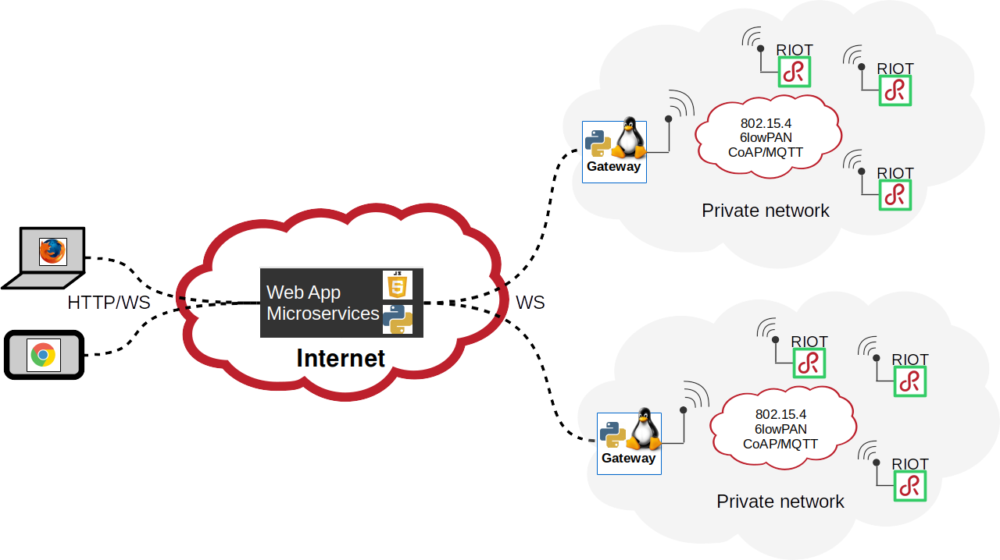
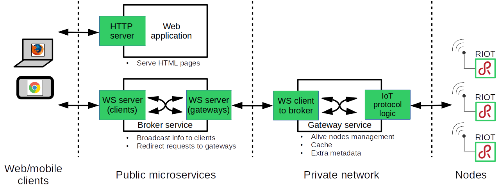

## Pyaiot, connecting small things to the web

[](https://travis-ci.org/pyaiot/pyaiot)

Pyaiot provides a set of services for interacting and transporting data coming
from IoT devices using regular web protocols (HTTP). Pyaiot
relies on Python asyncio core module and on other more specific asyncio based
packages such as [Tornado](http://www.tornadoweb.org/en/stable/),
[aiocoap](http://aiocoap.readthedocs.io/en/latest/) or
[HBMQTT](http://hbmqtt.readthedocs.io/en/latest/index.html).
Pyaiot tries to only use standard protocols to connect the IoT devices to the
web: CoAP, MQTT, HTTP, etc

### The devices

Pyaiot main goal is to provide high level services for communicating
with **constrained** devices.
Those devices are generally microcontrollers and thus not able to run Linux.
Thus, we need a specific OS to run on those kind of devices. For this, we
initially chose [RIOT](https://riot-os.org) because it provides an hardware
independent layer along with the standard network stacks required to
communicate with the devices from a network.

The source code of RIOT firmwares running on the devices is available in
[another repository on GitHub](https://github.com/pyaiot/riot-firmwares).

Other devices with communication capabilities can also be used. In this
repository, we also provide a [Micropython script](utils/pycom) that can be
used on [Pycom devices](https://www.pycom.io/).
This script only works with the [mqtt gateway service](pyaiot/gateway/mqtt).

### Available services

Pyaiot is built around several microservices:
* A public central **broker**
* A public web application for the **dashboard**
* Private distributed **gateways**



The role of the broker is to put in relation gateways and web clients in
order to be able to transfer in a bi-directionnal way messages coming from
devices, via the gateways, to clients and vice versa.

The broker is in charge of the management of the list of gateways. The role of
the gateways is to convert protocols used by the devices to the web protocols
used internally by Pyaiot to transfer information between the different
services. In order to guarantee reactivity and security, this internally used
protocols rely on HTTP websockets.

The Dashboard is a web page with some embbeded javascript that displays the
list of available devices and their status. It also allows to interact with the
devices (LED control, Robot control, etc)



3 examples of gateways are provided by pyaiot:
* A CoAP gateway that manages a list of alive sensor devices by running its own
CoAP server
* A MQTT gateway that manages a list of alive sensor devices by subscribing and
publishing messages to a MQTT broker.
* A Websocket gateway dedicated to devices: each node is connected via a
websocket

#### The CoAP gateway

Here we describe how the CoAP gateway interacts with devices.

When a node starts, it notifies itself to its gateway by sending a CoAP
post request. On reception, the gateway converts and forwards this message to
the broker server. In the mean time, the gateway initiates a discovery of the
resources provided by the node (using the CoAP .well-known/core resource).
Once available resources on the node are known, the gateway sends to the broker
update messages.
The broker simply broadcasts those notification messages to all connected
web clients.

To keep track of alive devices, each node has to periodically send a notification
message to its gateway.
If a sensor node has not sent this notification within 120s (default,
but this is configurable), the gateway automatically removes it from the list
of alive devices and notifies the broker.

#### The MQTT gateway

MQTT do things differently from CoAP: the devices and the gateway have to publish
or subscribe to topics to exchange information.

A resource discovery mechanism is also required for the gateway to determine
the list of available resources on a node. In Pyaiot, the gateway and the devices
are used as clients of the same MQTT broker.

Since the devices are constrained, we decided to use the
[mosquitto.rsmb broker](https://github.com/eclipse/mosquitto.rsmb). Some
documentation and a sample systemd service file is provided in the
[pyaiot/gateway/mqtt directory](./pyaiot/gateway/mqtt/systemd).

With the MQTT gateway, each node is identified by a \<node_id\> and this
identifier is used to build the topics specific to a given node.

Topics the devices publish to/the gateway subscribes to are:
* `node/check` with payload `{'id': <node_id>}`. Once started, each node
  publishes periodically (every 30s) on this topic.
* `node/<node_id>/resources` with payload `[<resource 1>, <resource 1>]`. This
comes as a reply to the gateway request for resources available on a given node.
* `node/<node_id>/<resource>` with payload `{'value': <resource_value>}`.
Depending on the type of resource, a node can publish periodically or not or on
demand on this topic.

Topics the devices subscribe to/the gateway publishes to are:
* `gateway/<node_id>/discover` with 2 possible payloads:
  * `resources`: then the node publish on `node/<node_id>/resources`
  * `values`: then, for each resource, the node publish on
    `node/<node_id>/<resource>`
* `gateway/<node_id>/<resource>/set` with a payload depending on the resource:
  update the value of the resource on the node (LED toggle, text, etc)

#### The websocket gateway

The behavior with a websocket gateway is similar to the CoAP gateway except
that the node doesn't have to send notifications periodically: the node is lost
when the connection is closed.

### Available Demos

See Pyaiot in action within 2 demos:
* [RIOT](http://riot-os.org): You can find a permanent demo instance configured
  as a showroom for RIOT. This showroom is available at
  http://riot-demo.inria.fr.

* [IoT-LAB open A8 demo](utils/iotlab)
  This demo automatically submits an experiment on IoT-LAB with two open A8
  devices. The first node is configured as a border router and the second node
  runs a firmware that integrates automatically in the RIOT Demo Dashboard
  described above.

### Usage

1. Clone this repository
  ```
  $ git clone https://github.com/pyaiot/pyaiot.git
  ```
2. Install the command line tools (only Python 3 is supported)
  ```
  $ pip3 install . --user
  ```
3. Generate authentication keys
  ```
  $ aiot-generate-keys
  ```
4. Start the broker
  ```
  $ aiot-broker --debug
  2019-04-08 16:11:58,816 -  pyaiot.broker -  INFO - Application started, listening on port 8000
  ```

  You can get more information on available option using `--help`:
  ```
  $ aiot-broker --help
  [...]
  --broker-host                    Broker host (default localhost)
  --broker-port                    Broker websocket port (default 8000)
  --config                         Config file
  --debug                          Enable debug mode. (default False)
  --key-file                       Secret and private keys filename. (default
                                   /home/<user>/.pyaiot/keys)
  ```
5. Start one of the gateways, let's say the coap gateway
  ```
  $ aiot-coap-gateway --debug --coap-port=5684
  ```
  By default the CoAP server running with gateway is using port 5683, but here
  we specify another one, to not conflict with the test coap node that will be
  started below.

6. Start a CoAP test node, just for testing if you don't have a real hardware.
  This test node simulates a compatible interface and is handy for debugging
  purposes.
  ```
  $ python3 utils/coap/coap-test-node.py --gateway-port=5684  --temperature --pressure
  ```
7. Setup and start a local web dashboard
  ```
  $ cd pyaiot/dashboard/static
  $ npm install
  $ aiot-dashboard --debug
```
  Then open http://localhost:8080/ in your web browser.


### Dashboard local development against an external IoT broker instance

Here we take as example the online demo available at http://riot-demo.inria.fr.
The websocket server of the broker service is reachable on port 80.
As the broker and the dashboard are decoupled in 2 distinct services,
it's possible to run a local dashboard application serving dashboard web page
that itself connects to the broker.
This way your dashboard will display the available devices on the online RIOT
demo.

Then you can start the dashboard application:
```
$ aiot-dashboard --debug --broker-host=riot-demo.inria.fr --broker-port=80
```
and open a web browser at [http://localhost:8080](http://localhost:8080).
When the web page is loaded, it directly connects to the broker websocket
server and starts communicating with the devices.
